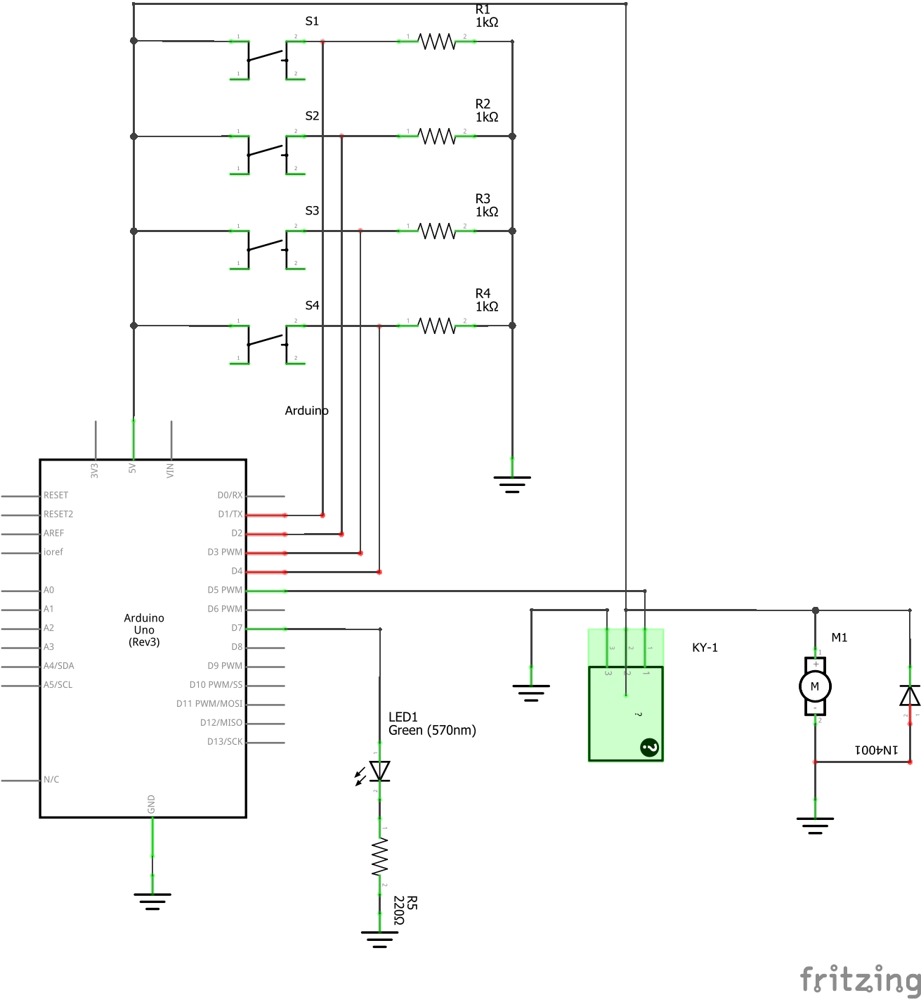

# Arduino_KVIZ
### Avtorji
- Matevž Prašnikar
- Gašper Nemet
## Navodila
Krmiljenje transporta palet: Paleta se pomika po transportnem traku 1 na dvižno mizo do senzorja B1 (uporabite stikalo) - pomik po tem traku je na osnovi kotaljenja. Ko paleta aktivira senzor B1 (B1 = 1), se vključi sistem za hidravlično dviganje mize (zelena LED). Dvigovanje mize se zaustavi, ko se aktivira senzor B3. Po aktiviranju senzorja B3 se vključi transport palete na trak 2 (motorček se vklopi preko releja). Aktiviranje senzorja B4 označi, da je paleta zapustila dvižno mizo in da se lahko miza spusti v spodnjo lego, kjer se aktivira senzor B2 in miza se ustavi. Za senzorje uporabite stikala/tipke.

## Kosovnica
- 4x tipke
- 1x zelena LED
- 1x rele
- 1x motor
- 1x zaščitna dioda
- 4x upor 1kΩ
- 1x upor 220Ω

## Priredbeni seznam
### Vhodi
| Oznaka v načrtu| Naslov operanda | Vrsta kontakta | Pomen |
| -------------- | --------------- | -------------- | ----- |
| S1         | X0           |  N.C.              | Se vključi sistem za hidravlično dviganje mize (zelena LED)      |
| S2      | X1            |    N.C.            |   Paleta je zapustila dvižno mizo in da se lahko miza spusti v spodnjo lego     |
| S3      | X2            |    N.C.            |   Se vključi transport palete na trak 2 (motorček se vklopi preko releja)     |
| S4      | X3            |    N.C.            |   miza se ustavi     |

### Izhodi
| Oznaka v načrtu| Naslov operanda | Aktiven pri    | Pomen |
| -------------- | --------------- | -------------- | ----- |
| LED1         | Y0           | 1              |       |
| M1      | Y1            |  1             | Motor se zažene      |

## Breadboard vezava

## Shema

## Komentarji
